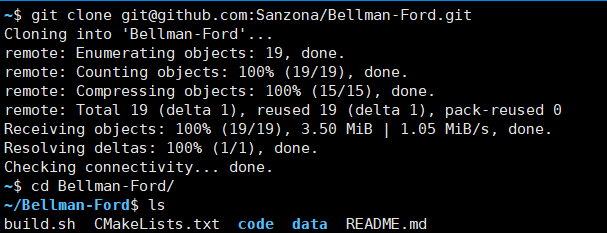
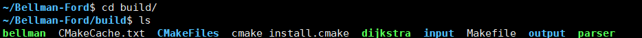
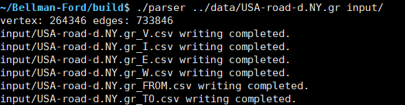
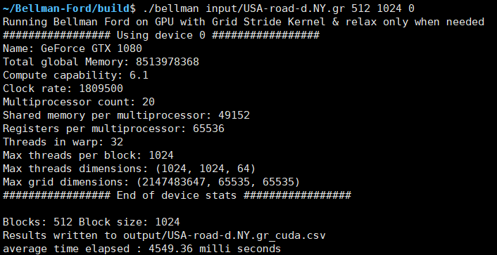
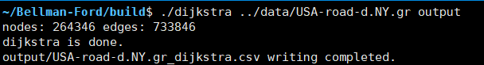
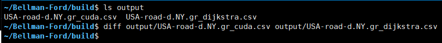
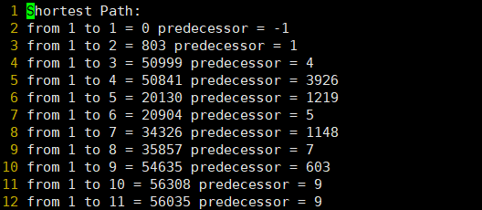

## Bellman-Ford

使用CUDA实现Bellman-Ford算法。


## Install

```bash
git clone git@github.com:Sanzona/Bellman-Ford.git

cd Bellman-Ford
```




## Compile

```bash
bash build.sh

cd build
```




## Run

```bash
# parse data
./parser ../data/USA-road-d.NY.gr input/

# run bellman
./bellman input/USA-road-d.NY.gr 512 1024 0

# dijkstra for test.
./dijkstra ../data/USA-road-d.NY.gr output
```

















## References

[sengorajkumar/gpu_graph_algorithms](https://github.com/sengorajkumar/gpu_graph_algorithms)

[Bellman-Ford Single Source Shortest Path Algorithm on GPU using CUDA](https://towardsdatascience.com/bellman-ford-single-source-shortest-path-algorithm-on-gpu-using-cuda-a358da20144b)

